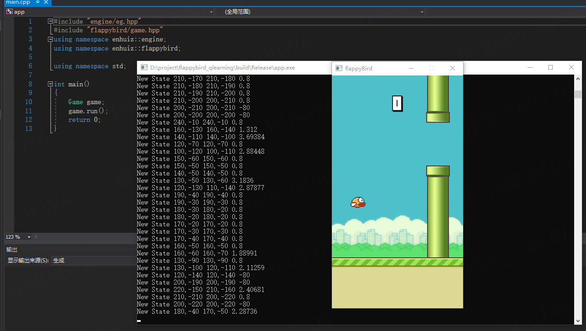

# Flappy Bird Q-learning
This is a flappy bird game played by Q-learning.

# How To Run
```
$ mkdir build
$ cd build
$ cmake ..
$ make
$ ./app
```

## origin from https://github.com/enhuiz/flappybird-qlearning
## 以上为原作者简单的reademe，以下是我的补充
## 本地编译

#依赖库

1. SDL2    下载链接：https://github.com/libsdl-org/SDL/releases
2. SDL2_image   下载链接：https://github.com/libsdl-org/SDL_image/releases

注意：下载源代码，而不是编译后的

此次实验选择的版本为：
SDL2_image-2.6.1.zip
SDL2-2.0.22.tar.gz

 

step1:下载好这两个库后，采用Cmake进行默认编译，编译安装路径采用默认的。
默认安装在C:/Program Files/SDL2 和 C:/Program Files/SDL2_image


step2：将C:/Program Files/SDL2_image/include下的SDL2_image.hpp拷贝到，C:/Program Files/SDL2/include下

step3：将C:/Program Files/SDL2_image/lib/SDL2_image.lib拷贝到，C:/Program Files/SDL2/lib/下

step4：cmake构建 flippy bird

step5：将SDL2的运行库拷贝到到当前release目录下

注意：只有在Release下，才能够正常运行，debug下，SDL2的库出错。


#运行截图：


#训练一段时间后的截图


